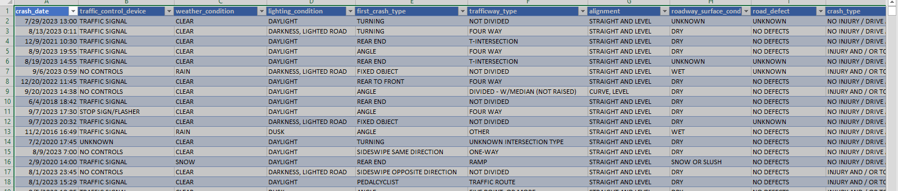
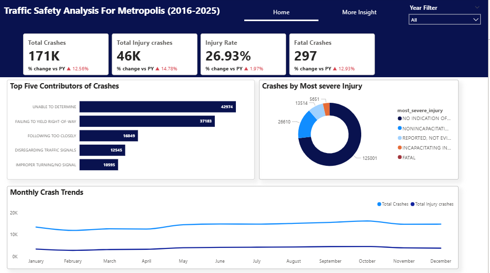

# Traffic safety Analysis Report for Metropolis (2016- 2025)

## Executive summary
The analysis was conducted to evaluate the traffic safety for Metropolis from 2016 to 2025. The analysis identified monthly crash trends over the specified years, gave insights into crash by the top contributors, crash by most severe injury, crash by traffic way type, weather conditions and how they impact on crashes and crashes by crash hour. It also identified changes in key areas of concerns such as Total crash, total injury crash, injury rate and fatal crash.

## Business Context
The Mayor of Metropolis requested a data-driven report to understand traffic crash patterns from the last decade to prioritize safety initiatives and justify next year's budget. The goal was to transform raw crash data into an insightful, interactive Power BI report that tells a clear story and provides actionable recommendations for leadership.

## Objectives
The objectives of the analysis are:
- To identify key trends in traffic crashes over the 10-year period.
- To analyze the primary causes and types of crashes that lead to the most severe outcomes.
- To provide actionable insights to inform public safety campaigns, police enforcement, and infrastructure investments.

## Data Overview
The analysis is based on a consolidated dataset of over 209,000 cases of accidents and 24  columns from 2016 to 2025. It is a record of all accidents that occurred within the Metropolis.

## Data Preview

## Key Findings
- There has been a small but steady decrease in crashes after 2019.
- The highest contributors of crashes have consistently been those that fall under “Unable to determine”.
- Most of the accidents fall into “No indication of injury”.
- October is the month with the most crashes.
- The traffic way types that pose high risk are roadways with no divide.
- The peak incident time is between 15:00 and 17:00.
- Most crashes occur in clear weather.

## Dashboard

## Link to Power BI Report
Click the link to access the full Power BI Report [Click here](https://app.powerbi.com/view?r=eyJrIjoiZjEzYzYzZDAtYjVhMS00YjE1LThkYzItMDQwMmEzYjMzMmI5IiwidCI6IjA3MDQxNTMxLWM0YjgtNGM0MS05Y2RlLWNmNjQ2MzViYjkwYyJ9 )

## Data Cleaning and Transformation
- Dataset from years that fall outside the specified years were removed.
- Created the date table from the crash date column.
- The damage column was transformed into a damage midpoint column.
- The crash date column was converted into the right data type.

## Detailed findings and Analysis
### Key performance indicators with YoY change
- There was a steady increase in the number of crashes from 2016 till 2019.
- There has been a steady decrease in the number of crashes from 2020 to 2025 except for 2024 where there was a 0.77% percent increase from the previous year.
- There was a steady increase in the number of injury crashes from 2016 to 2018 while the number decreased from 2019 to 2025 except for 2021 and 2024.
- There was a steady increase in the number of fatal crashes from 2016 to 2018 while the number decreased from 2019 to 2025 except for 2020 where there was over 100% increase from the previous year. 

### Contributors of Crashes
- The highest number of crashes were those whose causes were unable to be determined except for in 2018 where the main contributor of crashes was ‘failing to yield right of way’.

### Crashes by most severe injury		
- Across the entire years, most of the crashes have shown no indication of injury.
- The fatality rate is less than 1% of total crashes across the years.
  
### Monthly crash trend
- October is the month with the highest number of crashes followed by June, July and May.
  
### Crash by Traffic way Type
- From 2016 to 2021, the traffic type causing the most crashes are those “Not divided”.
- From 2022 to 2025, the “Four way” type has caused the most crashes.

### Crashes by weather condition
- Over the years, most of the crashes have occurred in clear weather conditions, closely followed by rainy weather.

### Crashes by Crash hour
- The hour with the most crashes is 17:00 across the ten years.

